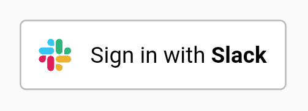
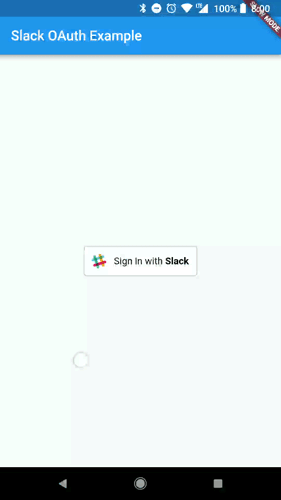

[](https://pub.dartlang.org/packages/flutter_slack_oauth) 

# flutter_slack_oauth
A flutter OAuth package for Slack with a beautiful "Sign in with Slack" button.



## Usage
To use this plugin, add `flutter_slack_oauth` as a dependency in your pubspec.yaml file.



### Example
``` dart
import 'package:flutter/material.dart';
import 'package:flutter_slack_oauth/flutter_slack_oauth.dart';

void main() {
  runApp(new MaterialApp(
    home: new Scaffold(
      body: new Builder(
        builder: (BuildContext context) {
          return new Center(
            child: new SlackButton(
              clientId: "XXX_CLIENT_ID_XXX",
              clientSecret: "XXX_CLIENT_SECRET_XXX",
              redirectUrl:
                "https://kunstmaan.github.io/flutter_slack_oauth/success.html",
              onSuccess: () {
                Scaffold.of(context).showSnackBar(new SnackBar(
                  content: new Text('Slack Login Success'),
                ));
              },
              onFailure: () {
                Scaffold.of(context).showSnackBar(new SnackBar(
                  content: new Text('Slack Login Failed'),
                ));
              },
              onCancelledByUser: () {
                Scaffold.of(context).showSnackBar(new SnackBar(
                  content: new Text('Slack Login Cancelled by user'),
                ));
              },
            ),
          );
        },
      ),
    ),
  ));
}

```